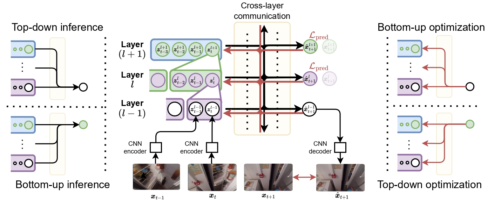

# STREAMER

The official PyTorch implementation of our NeurIPS'23 paper [STREAMER: Streaming Representation Learning and Event Segmentation in a Hierarchical Manner](https://ramymounir.com/publications/streamer/)



---

## Overview

### Documentation

Checkout the [documentation](https://ramymounir.com/docs/streamer/) of STREAMER modules to learn more details about how to use our codebase.

### Installation

```bash
pip install streamer-torch # with pip from PyPI
pip install git+'https://github.com/ramyamounir/streamer-torch' # with GitHub
```

### Inference

```python
from streamer.models.inference_model import InferenceModel

model = InferenceModel(checkpoint='to/checkpoint/path/')
result = model(filename='to/video/file/path')
```

> Note: Pretrained weights are coming soon..


### Training

In order to perform training with streamer:

1. Use the [Dataset README.md](streamer/preprocessing/README.md) to preprocess datasets for streaming loading and evaluation.
2. Use the provided [training script](streamer/train.py) to train on multiple gpus (i.e., or multi-node).
3. The script `streamer/experiments/compare.py` can be used to evaluate the model's prediction using Hierarchical Level Reduction.

> Bash scripts with CLI arguments are provided in `streamer/scripts/`

---

Citing STREAMER
-------
If you find our approaches useful in your research, please consider citing:
```
@inproceedings{mounir2023streamer,
  title={STREAMER: Streaming Representation Learning and Event Segmentation in a Hierarchical Manner},
  author={Mounir, Ramy and Vijayaraghavan, Sujal and Sarkar, Sudeep},
  booktitle={Thirty-seventh Conference on Neural Information Processing Systems},
  year={2023}
}
```


